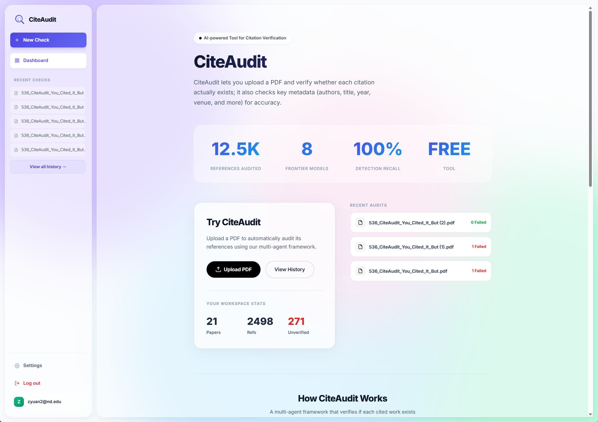
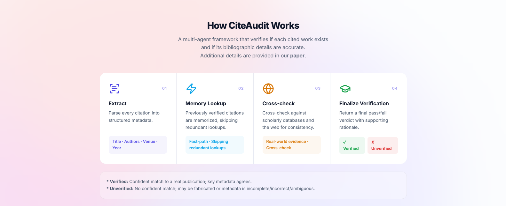
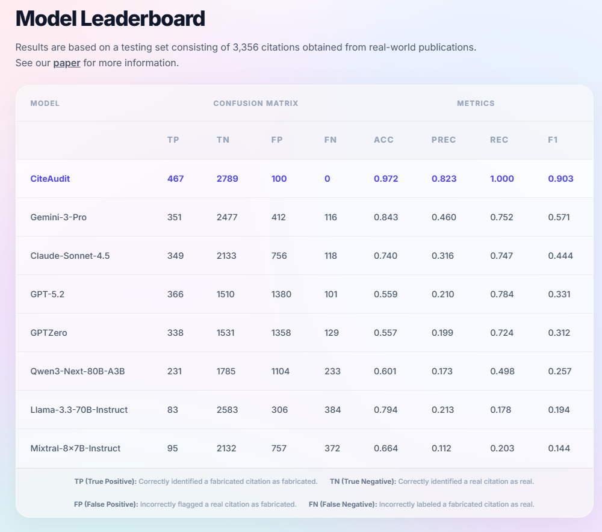
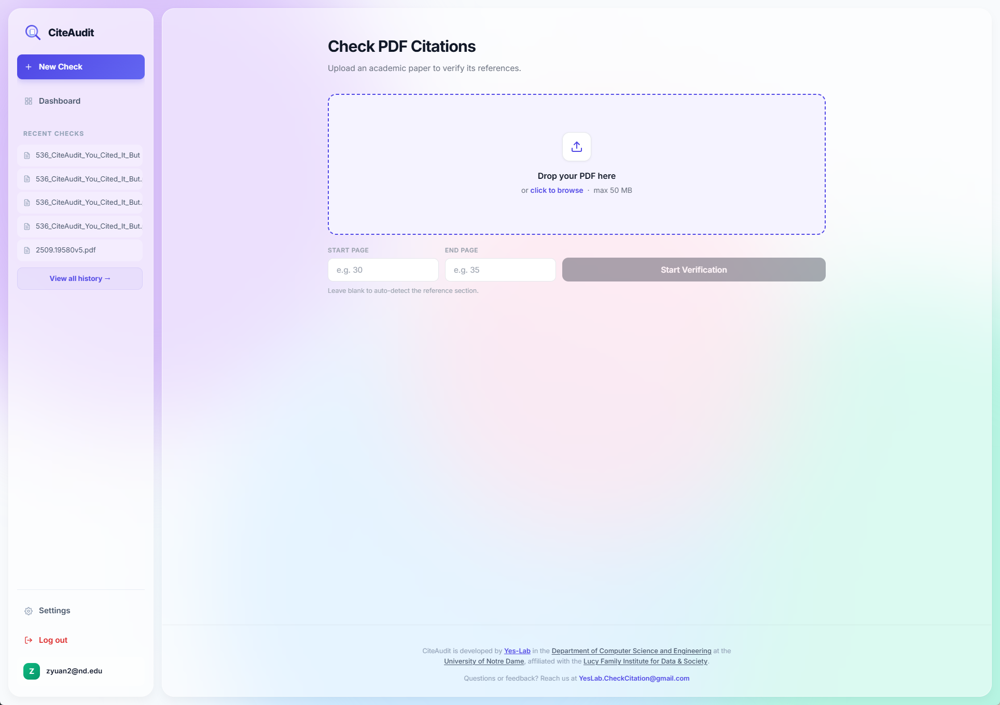
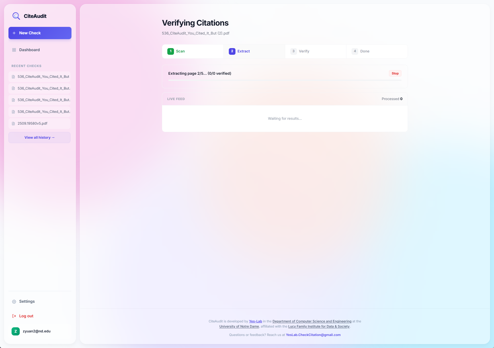
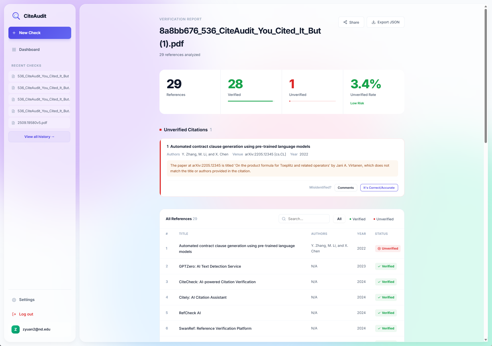

# CiteAudit: You Cited It, But Did You Read It? 

## A Benchmark for Verifying Scientific References in the LLM Era

**Official Website: [www.checkcitation.com](https://www.checkcitation.com/)**

### Introduction
**CiteAudit** lets you upload a PDF and verify whether each citation actually exists; it also checks key metadata (authors, title, year, venue, and more) for accuracy. In the era of Large Language Models (LLMs), ensuring the integrity of scientific references has never been more critical. CiteAudit provides a robust framework to automate this audit process, saving researchers time and preventing the propagation of "hallucinated" or incorrect citations.

---

### How It Works

CiteAudit employs a sophisticated pipeline to parse your document, extract citation strings, and cross-reference them against global scholarly databases. By analyzing both the context of the citation and the metadata of the source, CiteAudit ensures that every reference in your paper is both real and relevant.

---

### Benchmarking & Performance

We are proud to announce that CiteAudit achieves **State-of-the-Art (SOTA)** performance in citation verification. Compared to existing tools and manual auditing, CiteAudit offers superior recall and precision, identifying even the most subtle discrepancies in metadata or non-existent "ghost" citations.

---

### User-Friendly Interface

Getting started is simple. Our intuitive upload page allows you to drag and drop your research papers (PDF format) directly into the system. CiteAudit handles the rest, providing real-time feedback as it processes your document.

---

### Verification Workflow

Our automated workflow is designed for transparency and thoroughness:
1. **Extraction:** High-fidelity PDF parsing.
2. **Search:** Multi-source database lookup.
3. **Validation:** Metadata comparison and existence check.
4. **Scoring:** Accuracy and reliability assessment for each reference.

---

### Comprehensive Audit Reports

The culmination of the process is a detailed **CiteAudit Report**. This report highlights:
- **Verified Citations:** Confirmed references with correct metadata.
- **Warnings:** Potential typos or minor metadata mismatches.
- **Critical Errors:** Non-existent or highly suspicious citations that require immediate attention.

Maintain the highest standards of academic integrity with **CiteAudit**.
Check your papers now at **[www.checkcitation.com](https://www.checkcitation.com/)**.
